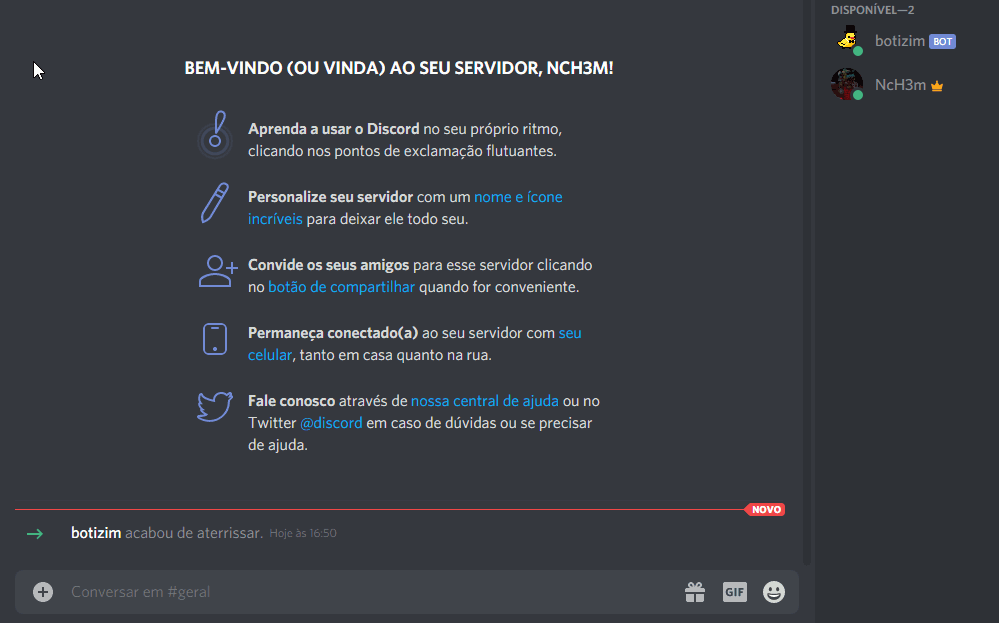
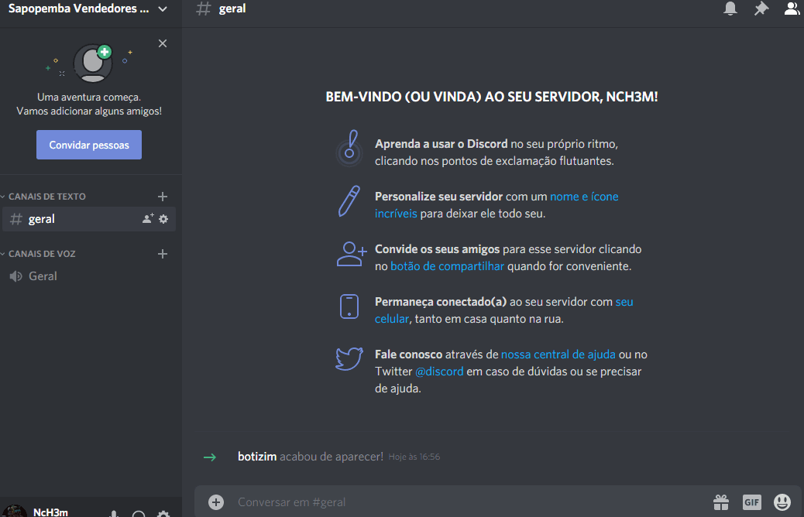

# Botizin
#### A simple discord bot with discord.js
## Getting Started
Download the project
```
git clone https://github.com/juststudies/botzin.git
```
or just download it as zip file.

Get your token in https://discord.com/developers/applications
&nbsp;
This is a just study about discord bots with discord.js lib. You're gonna find simples commands. 
To differentiate from the tutorials I made the command !make (allows you to create a command that calls for a image).
So... Take a look, feed the bot in a particular server.
&nbsp;

&nbsp;
And drop the command in another server that have the bot:
&nbsp;

&nbsp;

## Warnings
It's a simple bot for a simple study, I don't made cooldown or take security measures for a real and huge server, proceed at your own risk